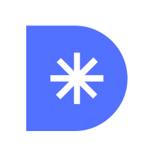
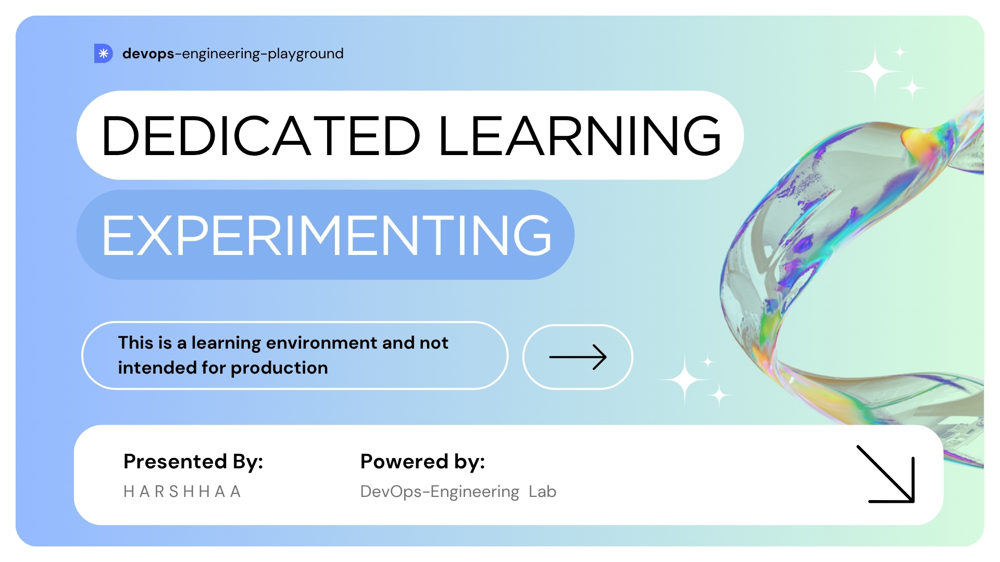

<!-- PROJECT LOGO -->
 

  

  <h3 align="center">devops-engineering-playground (beta)</h3>

  

    A personal space dedicated to learning, experimenting, and evolving as a DevOps engineer. This is a learning environment and not intended for production use. Some components may be partially implemented, outdated, or intentionally broken for learning purposes.
  

<!-- ABOUT THE PROJECT -->

## About The Project

  

🧭 **Purpose**:  
The primary goal of this playground is exploration and growth in the DevOps field. It serves as a digital notebook and lab bench where I:
- Experiment with various DevOps tools and practices
- Design and iterate on custom CI/CD workflows
- Practice infrastructure automation with tools like Terraform, Ansible, etc.
- Build out observability stacks for logging and monitoring
- Learn by doing — through trial, error, and iteration

🚧 **Disclaimer**:  
This is a learning environment and not intended for production use. Some components may be partially implemented, outdated, or intentionally broken for learning purposes.

(<a href="#readme-top">back to top</a>)

### Built With

- [![Next][Next.js]][Next-url]
- [![React][React.js]][React-url]
- [![Tailwind][Tailwind]][Tailwind-url]
- [![shadcn/ui][shadcn/ui]][shadcn/ui-url]

(<a href="#readme-top">back to top</a>)

[product-screenshot]: https://raw.githubusercontent.com/stackzero-labs/ui/refs/heads/main/app/opengraph-image.jpeg
[Next.js]: https://img.shields.io/badge/next.js-000000?style=for-the-badge&logo=nextdotjs&logoColor=white
[Tailwind]: https://img.shields.io/badge/tailwind-06B6D4?style=for-the-badge&logo=tailwindcss&logoColor=white
[Tailwind-url]: https://tailwindcss.com/
[shadcn/ui]: https://img.shields.io/badge/shadcnui-000000?style=for-the-badge&logo=shadcnui&logoColor=white
[shadcn/ui-url]: https://ui.shadcn.com
[Next-url]: https://nextjs.org/
[React.js]: https://img.shields.io/badge/React-20232A?style=for-the-badge&logo=react&logoColor=61DAFB
[React-url]: https://reactjs.org/

# DevOps Engineering Playground

Welcome to my **DevOps Engineering** Playground — a personal space dedicated to learning, experimenting, and evolving as a DevOps engineer.

> ⚠️ **Note:** This is *not* a production-ready toolkit. It's a hands-on lab environment where I try new ideas, test tools, break things on purpose, and explore how to glue technologies together in meaningful ways.

---

## 🧭 Purpose

The primary goal of this repository is **exploration and growth** in the DevOps field. It serves as a digital notebook and lab bench where I:

* Experiment with various DevOps tools and practices
* Design and iterate on custom CI/CD workflows
* Practice infrastructure automation with tools like Terraform, Ansible, etc.
* Build out observability stacks for logging and monitoring
* Learn by doing — through trial, error, and iteration

---

## 🧰 Areas of Exploration

This repo contains practical experiments in the following areas:

| Area                              | Tools / Concepts                       |
| --------------------------------- | -------------------------------------- |
| **Infrastructure as Code (IaC)**  | Terraform, Pulumi, AWS CloudFormation  |
| **Configuration Management**      | Ansible, Chef, Bash scripting          |
| **Containers & Orchestration**    | Docker, Kubernetes, Helm               |
| **CI/CD Pipelines**               | GitHub Actions, Jenkins, GitLab CI     |
| **Cloud Platforms**               | AWS, GCP, Azure (selectively explored) |
| **Monitoring & Logging**          | Prometheus, Grafana, ELK Stack         |
| **Security & Secrets Management** | HashiCorp Vault, SOPS, IAM policies    |
| **Scripting & Automation**        | Bash, Python, Makefiles                |

---

## 🧪 What's Inside

This repo may include:

* ✅ Modular Terraform configurations
* ✅ Sample CI/CD workflows (GitHub Actions, GitLab CI)
* ✅ Kubernetes manifests and Helm charts
* ✅ Bash and Python scripts for automation
* ✅ Notes and documentation of what worked (and what didn't)
* ✅ Demos of observability stacks
* ✅ Experiments with self-hosted tools and services

---

## 🚧 Disclaimer

This is a **learning environment** and not intended for production use. Some components may be partially implemented, outdated, or intentionally broken for learning purposes.

---

## 📚 Future Goals

* Build a robust, reusable base infrastructure module
* Experiment with GitOps workflows using ArgoCD or Flux
* Try out policy-as-code tools like OPA / Conftest
* Set up zero-trust networking or service meshes (e.g., Istio)
* Simulate incident response scenarios

---

## 🤝 Contributing

Contributions, ideas, and feedback are welcome! Feel free to:

- Open issues for questions or problems you encounter
- Submit pull requests to share your own experiments
- Start discussions about DevOps practices and tools
- Share your learning experiences and insights

---

## 📝 License

This project is licensed under the MIT License - see the [LICENSE](LICENSE) file for details.

---

## 📬 Contact

- GitHub: [@NotHarshhaa](https://github.com/NotHarshhaa)
- LinkedIn: [Harshhaa Vardhan Reddy](https://linkedin.com/in/harshhaa-vardhan-reddy)
- Website: [notharshhaa.site](https://notharshhaa.site)
